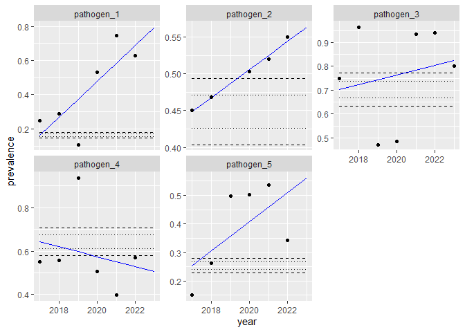
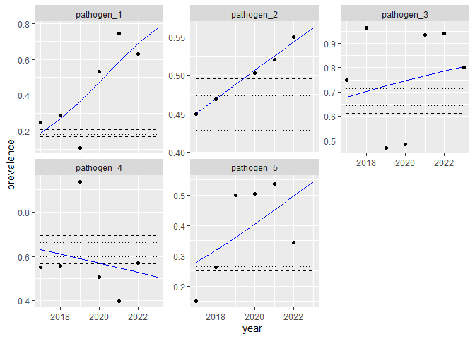

# Calculate and visualize trends in prevalence data
Brennan Chapman

``` r
## CHUNK: Setup
##        Set use_example_data parameter to FALSE to import project data,

usePackage <- function(p, repo = "https://cran.rstudio.com/") {
  if (!is.element(p, installed.packages()[,1])) install.packages(p, dep = TRUE, repos = repo)
  library(p, character.only = TRUE)
}

usePackage("tidyverse")     # Common Operations
usePackage("magrittr")      # Pipes
usePackage("ggplot2")       # Plots
usePackage("broom")         # Get Model Components
usePackage("here")          # Get Paths
```

``` r
## CHUNK: Import example data

example_data_path <- here::here("example_data.csv")
example_data      <- read_csv(file = example_data_path)

example_data %<>%
  mutate(prevalence = prevalence,
         n          = n, 
         successes  = round(prevalence * n), 
         failures   = n - successes)

thedata <- example_data
```

``` r
# Get the minimum and maximum year to predict and plot.
years_to_predict        <- seq(min(thedata$year), max(thedata$year))
names(years_to_predict) <- years_to_predict

# Set the percent change bounds to show on plots.
# bounds_value will be multiplied by 100 to represent as a percentage.
bounds_value <- 0.05
```

## Linear Model

A linear regression describes the linear relationship between an
independent (predictor) variable and a dependent (response) variable.
The fitted regression line is also called the *line of best fit* because
it minimizes differences between predicted responses and the observed
data (i.e., it minimizes residuals).

Here, we treat measures of prevalence as *continuous data*, conduct a
linear regression, and plot the line of best fit.

``` r
## CHUNK: Fit a regression model for each type of occurrence in the data set.

do_reg <- function(.data) {
  
  lm(formula = prevalence ~ year, .data)
  
}

linear_model_list <-
  thedata %>%
    group_by(name) %>%
    # Create nested object with data set.
    nest(.key = "observations") %>% 
    mutate(
      # Run the regression.
      regmodel = map(observations, do_reg), 
      # Get the regression coefficient for year; the slope of the regression line.
      coeff    = regmodel[[1]]$coefficients['year'], 
      # Get the p-value of the regression coefficient.
      pval     = summary(regmodel[[1]])$coefficients['year', 'Pr(>|t|)'], 
      glance   = map(regmodel, broom::glance)) %>%
    unnest(glance)
```

    # A tibble: 5 × 5
    # Groups:   name [5]
      name         coeff     pval r.squared adj.r.squared
      <chr>        <dbl>    <dbl>     <dbl>         <dbl>
    1 pathogen_1  0.105  0.0569      0.637          0.547
    2 pathogen_2  0.0191 0.000510    0.989          0.985
    3 pathogen_3  0.0203 0.654       0.0433        -0.148
    4 pathogen_4 -0.0231 0.653       0.0557        -0.180
    5 pathogen_5  0.0512 0.195       0.377          0.221

### Interpretation

-   The *coefficient* is the slope of the line of best fit; it is the
    predicted change in prevalence per year.
    -   When the slope is positive (\> 0), there is a positive trend.
    -   When the slope is negative (\< 0), there is a negative trend.
-   The *p-value* is the significance of the coefficient (via a
    [t-test](https://en.wikipedia.org/wiki/Student%27s_t-test)).
    -   The null hypothesis is that the coefficient (the slope) is 0.
-   The *R-squared* is the model’s [coefficient of
    determination](https://en.wikipedia.org/wiki/Coefficient_of_determination),
    which is a measurement of the proportion of variance explained by
    the model (i.e., goodness of fit).
-   The *adjusted R-squared* is the model’s coefficient of
    determination, normalized by the number of model terms.

### Plot

``` r
predict_from_model <- function(themodel, topredict) {
  
  broom::augment(themodel, newdata = tibble(year = topredict))
  
}

predict_from_linear_model <- function(.model, .xvalues) {
  
  # newdata must be list/df with the predictor(s) as column names.
  predictions <- predict(object  = .model, 
                         newdata = tibble(year = .xvalues), 
                         type    = "response")
  
  # Return a df with predictor column(s).
  tibble(year       = .xvalues, 
         prediction = predictions)
  
}

linear_model_predictions <- 
  linear_model_list %>%
    mutate(predicted_values = map(regmodel, predict_from_linear_model, years_to_predict)) %>%
    unnest(predicted_values) %>%
    group_by(name) %>%
    arrange(name, year) %>%
    mutate(delta_year_one = prediction - first(prediction), 
           lower_bound_02 = first(prediction) * (1 - bounds_value * 2),
           lower_bound_01 = first(prediction) * (1 - bounds_value),
           upper_bound_01 = first(prediction) * (1 + bounds_value),
           upper_bound_02 = first(prediction) * (1 + bounds_value * 2), 
           fold_change    = abs( first(prediction) - (prediction) ) / first(prediction)
           )
```

``` r
## CHUNK:  Plot the data, expected values, and change bounds.
##         warning=FALSE to suppress missing values warning.

ggplot() +
  
  # Plot lower and upper bounds of percent change.
  geom_line(data = linear_model_predictions, aes(x = year, y = lower_bound_02), linetype = 'dashed') +
  geom_line(data = linear_model_predictions, aes(x = year, y = lower_bound_01), linetype = 'dotted') +
  geom_line(data = linear_model_predictions, aes(x = year, y = upper_bound_01), linetype = 'dotted') +
  geom_line(data = linear_model_predictions, aes(x = year, y = upper_bound_02), linetype = 'dashed') +
  
  # Plot the predicted values.
  geom_line(data = linear_model_predictions, aes(x = year, y = prediction), colour = "blue") +
  
  # Alternative method of generating a line of best fit.
  # geom_smooth(data = thedata, aes(x = year, y = prevalence), method = lm, se  = FALSE) +
  
  # Plot the raw data.
  geom_point(data = thedata, aes(x = year, y = prevalence)) +

  # Label the y axis.
  labs(y = "prevalence") + 
  
  # Facet, wrapping label names.
  facet_wrap(facets = vars(name), scales = "free_y", labeller = labeller(name = label_wrap_gen(20)))
```



Dotted horizontal lines represent a 5% change in prevalence.

Dashed horizontal lines represent a 10% change in prevalence.

## Binomial Model

Above, we treated prevalence data as continuous, even though they are
not continuous. Prevalence data are a proportion derived from discrete
counts of successes and failures of individual trials, and therefore
have a binomial (and not normal) distribution.

At an individual trial level, where the outcome is either 0 or 1, we can
use logistic regression to assess relationships between variables.

At a group (prevalence) level, where the outcome is a series of 0s and
1s (or a proportion/percentage), we can use a binomial regression to
assess relationships between variables.

``` r
## CHUNK: Fit a regression model for each type of occurrence in the data set.

do_br <- function(.data) {
  
  # Standard model, using vectors of successes and failures as the dependent variable.
  glm(formula = cbind(successes, failures) ~ year, 
      family  = binomial(link = "logit"), 
      data    = .data)
  
  # Alternative model, using prevalence as the dependent variable, weighted by
  # the number of trials/observations (n). These models should be equivalent.
  # glm(formula = prevalence ~ year, 
  #     family  = binomial(link = "logit"), 
  #     weights = n, 
  #     data    = .data)
  
}

binomial_model_list <-
  thedata %>%
  group_by(name) %>%
    # Create nested object with data set.
    nest(.key = "observations") %>% 
    mutate(
      regmodel = map(observations, do_br), 
      coeff    = exp(coef(regmodel[[1]]))[['year']], 
      pval     = summary(regmodel[[1]])$coefficients['year', 'Pr(>|z|)'], 
      glance       = map(regmodel, broom::glance)) %>%
    unnest(glance)


# So when we increase  by one unit, the odds of Y are multiplied by exp(b1)
```

    # A tibble: 5 × 3
    # Groups:   name [5]
      name       coeff     pval
      <chr>      <dbl>    <dbl>
    1 pathogen_1 1.56  1.48e-19
    2 pathogen_2 1.08  9.21e- 2
    3 pathogen_3 1.12  3.09e- 3
    4 pathogen_4 0.920 5.84e- 2
    5 pathogen_5 1.21  3.97e- 5

### Interpretation

-   The *coefficient* is the odds ratio; it is a fold change (a
    multiplicative factor) in the odds of occurrence year over year.
    -   When the odds ratio is greater than 1, there is a positive
        trend.
    -   When the odds ratio is less than 1, there is a negative trend.
-   The *p-value* is the significance of the coefficient (via a
    [z-test](https://en.wikipedia.org/wiki/Z-test)).
    -   The null hypothesis is that the coefficient (the odds ratio) is
        1.

### Plot

``` r
predict_from_binomial_model <- function(.model, .xvalues) {
  
  # Setting type = 'response' returns probabilities; type = 'link' returns logits.
  # newdata must be list/df with the predictor(s) as column names.
  predictions <- predict(object  = .model, 
                         newdata = tibble(year = .xvalues), 
                         type    = "response")
  
  # Return a df with predictor column(s).
  tibble(year       = .xvalues, 
         prediction = predictions)
  
}

binomial_model_predictions <- 
  binomial_model_list %>%
    mutate(predicted_values = map(regmodel, predict_from_binomial_model, years_to_predict)) %>%
    unnest(predicted_values) %>%
    mutate(delta_year_one = prediction - first(prediction), 
           lower_bound_02 = first(prediction) * (1 - bounds_value * 2),
           lower_bound_01 = first(prediction) * (1 - bounds_value),
           upper_bound_01 = first(prediction) * (1 + bounds_value),
           upper_bound_02 = first(prediction) * (1 + bounds_value * 2), 
           fold_change    = abs( first(prediction) - (prediction) ) / first(prediction),
           )
```

``` r
## CHUNK: Plot the data, expected values, and change bounds.
##        warning=FALSE to suppress missing values warning.

ggplot() +
  
  # Plot lower and upper bounds of percent change.
  geom_line(data = binomial_model_predictions, aes(x = year, y = lower_bound_02), linetype = 'dashed') +
  geom_line(data = binomial_model_predictions, aes(x = year, y = lower_bound_01), linetype = 'dotted') +
  geom_line(data = binomial_model_predictions, aes(x = year, y = upper_bound_01), linetype = 'dotted') +
  geom_line(data = binomial_model_predictions, aes(x = year, y = upper_bound_02), linetype = 'dashed') +
  
  # Plot the predicted values.
  geom_line(data = binomial_model_predictions, aes(x = year, y = prediction), colour = "blue") + 
  
  # Plot the raw data.
  geom_point(data = thedata, aes(x = year, y = prevalence)) +

  # Label the y axis.
  labs(y = "prevalence") + 
  
  # Facet, wrapping label names.
  facet_wrap(facets = vars(name), scales = "free_y", labeller = labeller(name = label_wrap_gen(20)))
```



Dotted horizontal lines represent a 5% change in prevalence.

Dashed horizontal lines represent a 10% change in prevalence.
