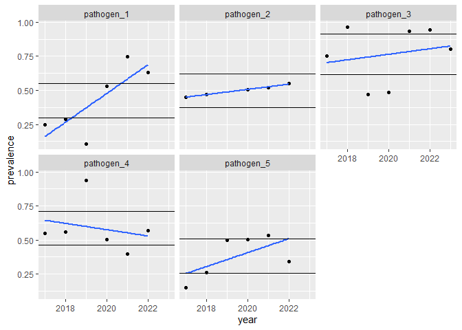

# Calculate and plot a line of best fit
Brennan Chapman

This script calculates and plots a line of best fit for a data set in
long format, consisting of pathogen prevalence by year.

``` r
## CHUNK: Setup

usePackage <- function(p, repo = "https://cran.rstudio.com/") {
  if (!is.element(p, installed.packages()[,1])) install.packages(p, dep = TRUE, repos = repo)
  library(p, character.only = TRUE)
}

usePackage("tidyverse")     # Common Operations
usePackage("magrittr")      # Pipes
usePackage("ggplot2")       # Plots
usePackage("broom")         # Get Model Components
usePackage("here")          # Get Paths
```

``` r
## CHUNK: Import data

# Set the path to your data.
# CSV with columns: pathogen, year, prevalence.
thedata_path <- here::here("example_data.csv")

# Read the data.
thedata      <- read_csv(file = thedata_path)

# To demonstrate robustness, in the example data, pathogen_2 is missing a data 
# point (NA) and pathogen_3 has an extra data point.
```

## Calculate

``` r
## CHUNK: Calculate a line of best fit for each pathogen

# The linear regression model.
do_lm <- function(.data) {
  lm(formula = prevalence ~ year, .data)
}

# Calculate a linear model for each pathogen.
pathogen_lms <-
  thedata %>%
    group_by(pathogen) %>%
    # Create nested object with name "by_pathogen".
    nest(.key = "by_pathogen") %>% 
    # Do the regression on each nested object.
    mutate(lm = map(by_pathogen, do_lm)) %>%
    # Get the regression statistics.
    mutate(tidy = map(lm,
                      broom::tidy)) %>% 
    # Get more regression statistics.
    mutate(glance = map(lm,
                      broom::glance)) %>% 
    # Unnest, generating unique column names.
    unnest(c(tidy, glance), names_repair = "unique")
    
# Print the models.
pathogen_lms %>%
  select(pathogen, term, estimate, p.val = p.value...8, r.squared)
```

    # A tibble: 10 × 5
    # Groups:   pathogen [5]
       pathogen   term         estimate    p.val r.squared
       <chr>      <chr>           <dbl>    <dbl>     <dbl>
     1 pathogen_1 (Intercept) -212.     0.0572      0.637 
     2 pathogen_1 year           0.105  0.0569      0.637 
     3 pathogen_2 (Intercept)  -38.1    0.000530    0.989 
     4 pathogen_2 year           0.0191 0.000510    0.989 
     5 pathogen_3 (Intercept)  -40.2    0.660       0.0433
     6 pathogen_3 year           0.0203 0.654       0.0433
     7 pathogen_4 (Intercept)   47.2    0.649       0.0557
     8 pathogen_4 year          -0.0231 0.653       0.0557
     9 pathogen_5 (Intercept) -103.     0.196       0.377 
    10 pathogen_5 year           0.0512 0.195       0.377 

-   The *year* term is the slope of the line of best fit.
-   *r squared* is a measure of the proportion of variance explained by
    the model (i.e., goodness of fit).

## Plot

The *null slope* is the slope beyond which a trend is considered to be
positive or negative.

``` r
## CHUNK: Set the null bound

null_slope_value <- 0.05
```

The null slope is set at +/- 5%.

``` r
## CHUNK: Calculate the null bounds for each pathogen

# A function to get the prediction from the model.
predict_from_model <- function(themodel, topredict) {
  broom::augment(themodel, newdata = tibble(year = topredict))$.fitted
}

# Get a data frame containing one model per year.
pathogen_lms_predictor_term <- filter(pathogen_lms, term == "year")

# Calculate the null bounds.
null_bounds<- 
  thedata %>%
    group_by(pathogen) %>%
    # Get the median year and the number of years from the median to the range. 
    mutate(mid_year = median(year), 
           rg       = max(year - mid_year)) %>%
    # Keep only one row per year; the year does not matter, so take the first.
    slice_head(n = 1) %>%
    # Keep only useful columns.
    select(pathogen, mid_year, rg) %>%
    # Join with model data frame.
    left_join(select(pathogen_lms_predictor_term, pathogen, lm)) %>%
    # Predict at median year.
    mutate(pred_med_year = map(lm, predict_from_model, mid_year)) %>%
    # Unnest to remove list structure.
    unnest(pred_med_year) %>%
    # Calculate the bounds; the min and max of a line of best fit that is null.
    mutate(lower_bound = pred_med_year - null_slope_value * rg, 
           upper_bound = pred_med_year + null_slope_value * rg)
```

``` r
## CHUNK:  Plot the data, lines of best fit, and the null bounds

ggplot(data = thedata, aes(x = year, y = prevalence)) + 
  geom_point() +
  geom_smooth(method = lm, se  = FALSE) + 
  geom_hline(data = null_bounds, aes(yintercept = lower_bound)) + 
  geom_hline(data = null_bounds, aes(yintercept = upper_bound)) + 
  facet_wrap(facets = vars(pathogen))
```

    Warning: Removed 1 rows containing non-finite values (`stat_smooth()`).

    Warning: Removed 1 rows containing missing values (`geom_point()`).


